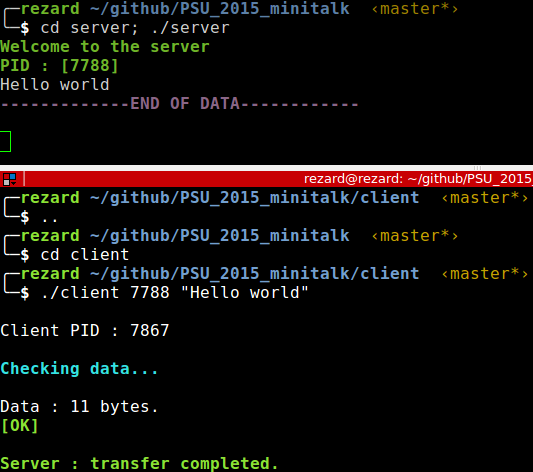

# PSU_2015_minitalk
Epitech first year project : [PSU] minitalk

Deadline : 3 weeks

Beginning of the project : 01/02/2016, 07h42

Group size : 1 person

# Minitalk

Minitalk is a tiny client-server program in C.

The server must display the string as fast as it can.

The server must handle multiple clients.


## Getting started

These instructions will allow you to obtain a copy of the operational project on your local machine for development and testing purposes.

### Prerequisites

What do you need to install the software and how to install it?

```
gcc
make
```

### Installation

Here's how to start the project on your computer

Clone and go in the directory PSU_2015_minitalk

Project compilation

```
make
```

Running project

Server:
```
cd server
./server
```
Client:
```
cd client
./client [PID] [message]
```

## Screenshot



## Build with

* [C](https://en.wikipedia.org/wiki/C_(programming_language))

## Auteurs

* **David Munoz** - [DavidMunoz-dev](https://github.com/davidmunoz-dev)
